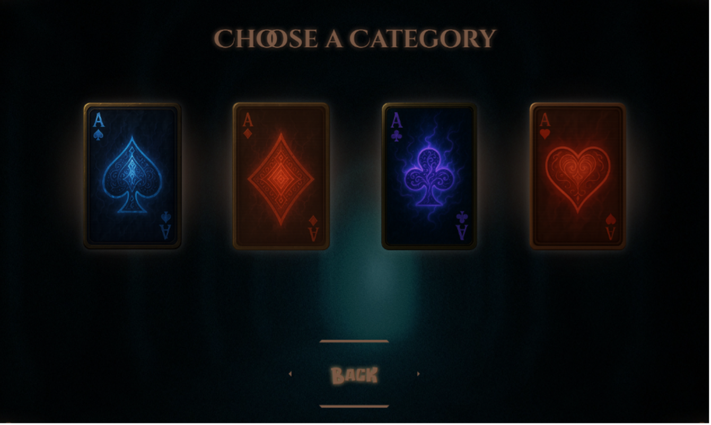
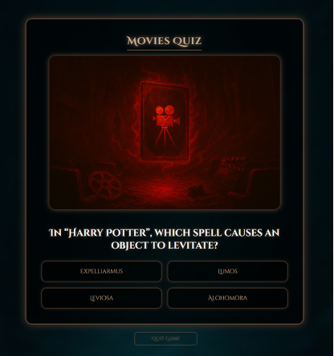
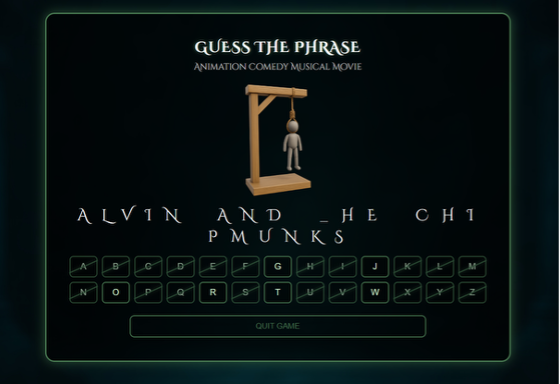
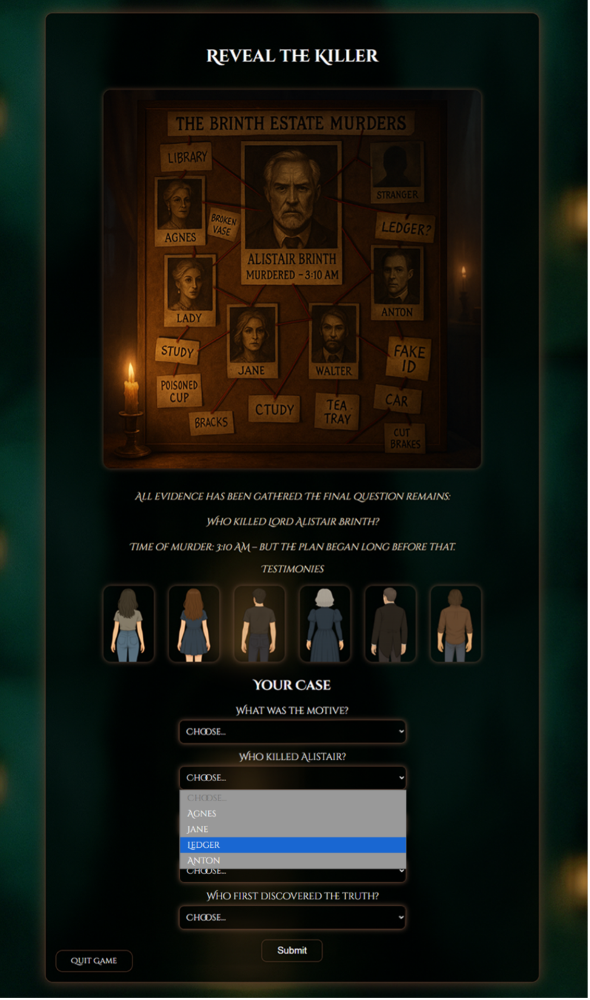
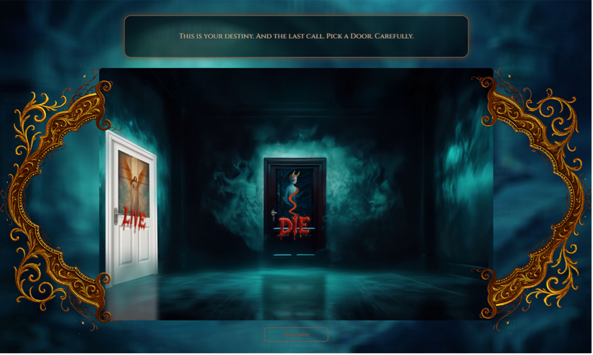
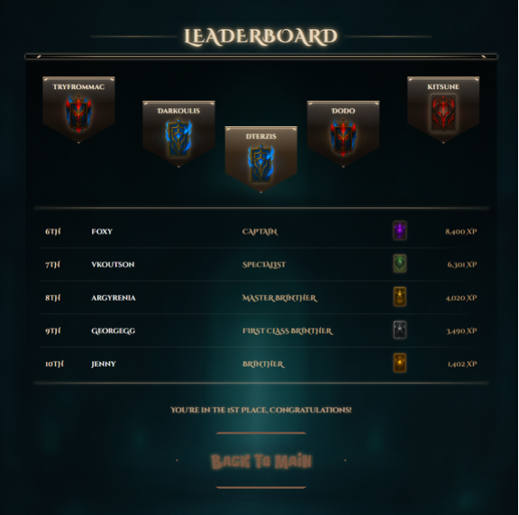

# Brinth | Web-Based Game Application (Academic Project)

Brinth is a web-based interactive game developed as part of an undergraduate thesis project.  
It combines elements of survival, logic, quizzes, and narrative-driven mystery into a single, unified experience inspired by *Alice in Borderland*, while introducing original mechanics, original storylines, and a structured progression system.

This repository serves as a **code showcase** for academic and professional evaluation purposes.

---

## Project Context

- **Type:** Undergraduate Thesis Project  
- **Field:** Web Applications & Game Systems  
- **Focus Areas:**  
  - Backend logic & system design  
  - Database-driven gameplay  
  - User progression & access control  
  - Narrative integration in web games  

The live, playable version of the game is hosted separately.  
This repository is intended to demonstrate **architecture, code structure, and implementation quality**, not to distribute a deployable product.

---

## Game Overview

Brinth is structured around **four card-based categories**, each representing a distinct gameplay philosophy:

- **Spades** – Quiz-based challenges (knowledge & logic)
- **Clubs** – Puzzle mechanics (*Hangman* and *Crack the Code*)
- **Diamonds** – Narrative-driven mystery cases
- **Hearts** – “Live or Die” logic challenges based on deception

Each category consists of progressively unlocked levels tied to experience points (XP).

---

## Core Game Mechanics

- **XP-Based Progression System**  
  Players unlock new content through accumulated experience.

- **Savior Cards System**  
  A limited-life mechanism controlling total playability.  
  Reaching `-1` permanently blocks access.

- **Ace of Cards**  
  Special unlockable aids that reveal hidden information in difficult games.

- **One-Time Game Rule**  
  Each mini-game can be played only once, enforced at both UI and backend level.

- **Role & Level System**  
  Player roles evolve from *Unclassified* to *Leader* based on XP thresholds.

---

## Technologies Used

### Backend & Frontend

### Tools

---

## System Design

- Fully database-driven game content
- JSON-based structure for dynamic mystery games
- Strong separation of logic, data, and presentation
- Centralized access control & validation mechanisms
- Replay prevention and XP-based access enforcement

---

## Security & Access Control

- Secure password hashing
- Email verification for sensitive actions
- Session-based authentication
- Protection against:
  - Direct URL access
  - Game replay
  - XP bypass attempts

---

## Responsive Design

- Desktop and mobile layouts
- Adaptive navigation (burger menu)
- Mobile-optimized leaderboards and UI components

---

## Documentation

The full academic documentation includes:
- System architecture diagrams
- Database ER diagrams
- Game flow logic
- UX evaluation
- Future extensions

This documentation is part of the official thesis and is not fully replicated here.

---

## Future Work

Planned or potential extensions include:
- Multiplayer or real-time competitive gameplay
- Cooperative puzzle mechanics
- Expanded narrative arcs
- Standalone desktop version with a 3D environment

---

## Usage Notice

This repository is provided **for review and evaluation purposes only**.  
The game is intended to be played via its official hosted version.

Reuse, redistribution, or deployment is **not the primary purpose** of this repository.

---

## Author

Developed by **Dimitrios Terzis**  
Undergraduate Thesis Project

---

## Visual Overview

The following screenshots provide a high-level visual overview of the Brinth application, highlighting the user interface, game structure, and progression systems.

> The images are included for demonstration and academic evaluation purposes only.

### Home Page

### Game Categories

### Spades – Quiz Gameplay

### Clubs – Hangman / Crack the Code

### Diamonds – Narrative Mystery Case

### Hearts – Live or Die Logic Game

### Player Statistics & Leaderboard

